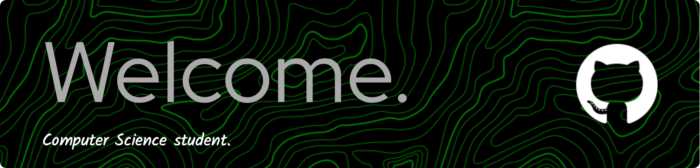

<picture>
  <source media="(prefers-color-scheme: dark)" srcset="https://raw.githubusercontent.com/platane/platane/output/github-contribution-grid-snake-dark.svg">
  <source media="(prefers-color-scheme: light)" srcset="https://raw.githubusercontent.com/platane/platane/output/github-contribution-grid-snake.svg">
  
</picture>

## About me:

Hi there! My name is Pablo Gómez Vidal, and I am a Computer Science student. My native language is Spanish but Im fluent in English too, Im also looking for new opportunities to learn and grow in the programming world.

  

I have a strong interest in competitive programming, where I can apply and learn some problem-solving skills and technical abilities. I enjoy participating in collaborative projects, leveraging my knowledge while acquiring new skills. 

  

I am particularly interested in areas such as artificial intelligence and software development, as well as topics like data structures and algorithms, and graph theory.
I am excited to contribute to open-source projects and collaborate with other technology enthusiasts.

## Reach me at: 

 

&nbsp;

##

<h3 align="left">Skill:</h3>

  

  

